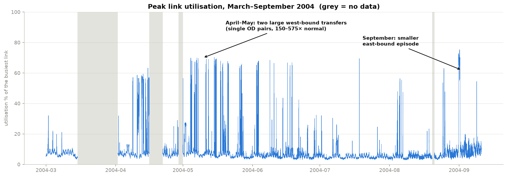
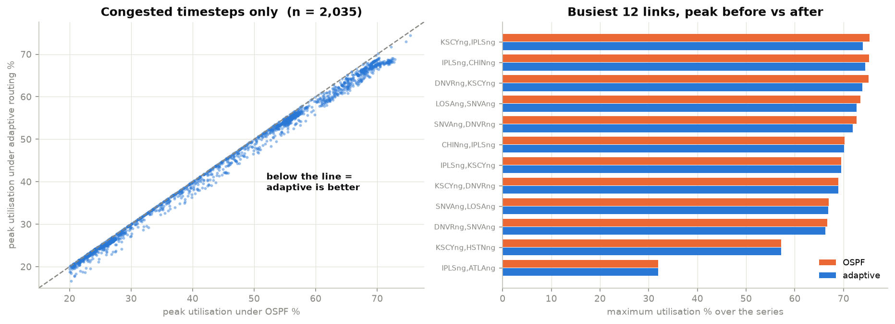
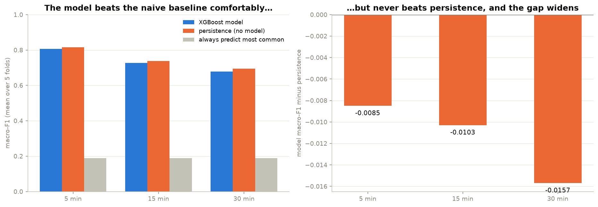

# Intelligent Network Congestion Prediction & Adaptive Routing

## Results at a Glance

Six months of real traffic from the Internet2 Abilene backbone (2004) — **48,096
five-minute snapshots across 30 links**, with real OC-192/OC-48 capacities and real
OSPF weights. Two goals: classify link congestion, and reroute traffic with Dijkstra
to pull load off the busiest links.

**Peak link utilisation reduced by 2.4%** on congested periods (44.79% → 43.72%);
series peak 75.36% → 74.48%, with no link pushed above capacity.

**Congestion classifier reaches macro-F1 0.81** — comfortably ahead of a naive
baseline (0.19), but it does **not** beat persistence (0.82). That is reported as
measured rather than tuned away, and the reason is understood: see below.



*Peak utilisation over the full 24 weeks. Grey bands are gaps in the source data.
The April–May and September bursts were each traced to specific origin–destination
flows in the raw traffic matrices.*



*Left: every congested timestep, OSPF vs adaptive — points below the diagonal are
improvements. Right: peak utilisation per link.* **Why only 2.4%:** at the busiest
moment a single OD flow carries **57% of all traffic on the network**, and 57.6% of
a 9.92 Gbps link by itself. Single-path routing must place that whole flow on one
path, so every link it crosses is ≥57.6% regardless of cost function. Beating that
needs flow *splitting* (ECMP / MPLS-TE) — a different mechanism. Identifying that
binding constraint is the more useful result than the percentage.



*The model beats the naive baseline at every horizon and never beats persistence,
with the gap widening as the horizon grows. Notebook 07 tested the obvious
follow-up — letting the model see neighbouring links — and found congestion does not
propagate along paths, so a neighbour is a redundant copy rather than an early
warning.*

▸ **[`notebooks/09_results_showcase.ipynb`](notebooks/09_results_showcase.ipynb)** —
the same results with the network diagram, rendered inline. Reads only saved
artefacts, runs in under 30 seconds.

---

An end-to-end machine-learning pipeline that **predicts congestion on network links**
from real backbone traffic measurements, then **adaptively reroutes traffic** using
Dijkstra's algorithm with dynamic edge-cost recalculation to reduce peak link
utilisation.

Built on **real measured data** from the Internet2 Abilene backbone (48,384
five-minute traffic matrices over six months) with real OC-192/OC-48 link capacities
and real OSPF weights — not synthetic traffic.

> **Status:** complete end to end — data pipeline, congestion classification, and
> adaptive routing all built and evaluated. Notebooks 01–08 below record what was
> tried, what worked, and what did not. See
> [`docs/dataset_selection.md`](docs/dataset_selection.md) for how the data was chosen.

## The notebooks

The whole project lives in eight Jupyter notebooks. They are the **canonical
implementation** — run them in order, 01 through 08. Each one reads what the
previous ones wrote to `data/processed/`.

```bash
jupyter notebook
```

### [`notebooks/01_data_and_utilization.ipynb`](notebooks/01_data_and_utilization.ipynb)

Loads the topology, real OC-192/OC-48 capacities, and the network's **own
OSPF-derived routing matrix** (paths are read from the data, never recomputed with
Dijkstra), loads all 24 weekly traffic-matrix files, audits the week boundaries,
and computes per-link utilisation as `demand @ A.T / capacity`.

Output: **48,096 timesteps × 30 links**, max utilisation **75.36%**, mean **2.69%**.
The 24 weekly files contain 4 gaps and 1 one-day overlap — see
[`data/README.md`](data/README.md#️-the-24-weekly-files-are-not-contiguous).

### [`notebooks/02_labeling_and_features.ipynb`](notebooks/02_labeling_and_features.ipynb)

Applies per-link percentile congestion labels and builds 16 **gap-aware** features
(lags, rolling mean/std, cyclical hour-of-day and day-of-week).

Gap-awareness works by reindexing onto a complete 5-minute grid with
`.asfreq("5min")` before applying `.shift()` and `.rolling()`. A lag that reaches
across a gap lands on an empty grid slot and yields `NaN` — there is no
gap-detection branch to get wrong. The notebook shows this concretely: at the first
row after the 18-day gap, every gap-aware lag is `NaN` while a naive `.shift()`
would hand the model a reading from 18 days earlier labelled "5 minutes ago".

### [`notebooks/03_eda.ipynb`](notebooks/03_eda.ipynb)

Exploratory analysis. Investigates the apparent "regime shift" and finds it is
**not** one: median utilisation is flat all six months, and what changes is the
tail. The surge is confined to **five links forming a single west-bound path**
(Chicago → Indianapolis → Kansas City → Denver → Sunnyvale → Los Angeles), the
reverse direction is unaffected, and it **switches on and off daily** rather than
shifting once. A second, smaller east-bound episode appears in September.

Also covers per-link distributions (80× threshold spread), inter-link correlation
(adjacent corridor links at 0.997 — congestion travels along paths), and when
Critical events occur (evening peak, weekdays, heavily clustered).

### [`notebooks/04_cv_split.ipynb`](notebooks/04_cv_split.ipynb)

Five-fold expanding-window `TimeSeriesSplit` with boundaries snapped to day edges,
and per-link congestion thresholds **refitted on each fold's training window only**
(fixing the leakage flagged in notebook 02). Refitting matters: the Critical line
for the corridor links moves **4–6×** across folds, while the other 25 links move
under 1.3×.

Test-set Critical rate ranges from **0.92% (fold 4) to 10.14% (fold 5)** against a
constant 5% in training — so per-fold scores must be reported, never just the mean.
Fold definitions saved to `data/processed/cv_folds.csv`.

### [`notebooks/05_baseline_model.ipynb`](notebooks/05_baseline_model.ipynb)

First baseline: `XGBClassifier` at default-ish settings, class imbalance handled
with `compute_sample_weight("balanced", …)`, evaluated across all 5 folds.
`utilization_pct` is **excluded** — the label is computed from it, so including it
would just be reading the answer.

Against always-predict-Low the model looks strong (macro-F1 **0.75–0.85** vs
**0.16–0.21**). But against a **persistence** baseline — "predict whatever class
this link was in 5 minutes ago" — it does **not** win: persistence scores higher on
3 of 5 folds and ties on the rest.

That looked like a task-framing problem: predicting time *t* from *t − 5 min* on a
smooth series is nowcasting, and `lag_1` nearly determines the label. Notebook 06
tests that explanation.

### [`notebooks/06_forecast_horizons.ipynb`](notebooks/06_forecast_horizons.ipynb)

Retrains at **15 and 30 minutes** ahead — same features, same folds, same model
settings, only the target changes. The persistence baseline is recomputed for each
horizon rather than carried over.

**The explanation was wrong.** The model does not beat persistence at any horizon,
and the gap *widens*:

| Lead time | Model macro-F1 | Persistence macro-F1 | Difference |
|---|---|---|---|
| 5 min | 0.8065 | 0.8150 | −0.0085 |
| 15 min | 0.7268 | 0.7371 | −0.0103 |
| 30 min | 0.6791 | 0.6948 | −0.0157 |

One confounder was found and ruled out first: the cyclical clock features were
anchored to the prediction time rather than the target time, an error that grows
with the horizon and could have manufactured the widening gap by itself. Fixing it
moved the gap by 0.0003–0.0011 — real bug, immaterial effect.

Reported as a real result rather than tuned away: **with per-link history and
time-of-day features, a learned classifier does not beat "assume nothing changed"
at any horizon tested.** Mean Critical F1 also falls 0.752 → 0.620 → 0.534.

The likely cause is train/test distribution shift (the model does best relative to
persistence on the calmest fold and worst on the most episode-dominated one).

### [`notebooks/07_crosslink_premise.ipynb`](notebooks/07_crosslink_premise.ipynb)

Tests the "use neighbouring links" idea *before* building it. The premise fails:
at a 15-minute lag, **1 link in 30** has any neighbour that predicts it better
than its own history, by **+0.0006** — noise. The median link is 0.17 correlation
*worse* off using a neighbour.

The reason is structural. Every consecutive corridor pair peaks at **lag 0** —
congestion does not propagate, links light up simultaneously. That follows from
how the data is built: `link_loads(t) = demand(t) @ A.T`, and `A` has no time
dimension, so every hop of a flow is loaded in the same timestep. The 0.997
correlation that motivated the idea is precisely why it fails — neighbours are
redundant copies, not early warnings.

Decision recorded rather than silently skipped: cross-link features are not built.

### [`notebooks/08_adaptive_routing.ipynb`](notebooks/08_adaptive_routing.ipynb)

Dijkstra with congestion-aware edge costs, `cost(e) = w(e) / (1 − u(e))` — the real
OSPF weight inflated by the M/M/1 delay factor. No tuning knobs; it collapses to
plain OSPF when the network is quiet (1.03× at typical 3% load) and bites hard when
it is not (4× at 75%). Routing for each interval is computed from the **previous**
interval's measured demand, so nothing depends on knowing the future.

The baseline is recomputed, not asserted: Dijkstra on the real OSPF weights
reproduces the shipped routing matrix **exactly** and the notebook 01 utilisation
to `0.000e+00`.

**A first attempt failed instructively** and is kept in the notebook. Rerouting all
flows simultaneously against a stale snapshot drove peak utilisation to **290%** —
every flow picked the same newly-cheap path and collectively overloaded it, landing
on `ATLAng,IPLSng`, one of only two OC-48 links. The fix is **sequential
assignment** (route flows largest-first, updating load after each), which is
standard traffic-engineering practice.

| Metric | OSPF | Adaptive | Change |
|---|---|---|---|
| worst link, whole series | 75.36% | 74.48% | −1.16% |
| p95 per-timestep peak | 15.80% | 15.36% | −2.78% |
| mean peak, congested steps | 44.79% | 43.72% | **−2.4%** |

It relieves rather than relocates (spread and std both improve, no link over 100%,
total network load unchanged at −0.02%), at the cost of some churn: 91% of
timesteps see at least one path change, though only ~4 of 144 flows move on average.

**Why the gain is small, and why that is not the algorithm's fault:** at the worst
timestep a single OD flow carries **5.71 Gbps — 57% of all traffic on the network,
and 57.6% of a 9.92 Gbps link on its own**. Single-path routing must place that
whole flow on one path, so every link it crosses is ≥57.6% regardless of cost
function. Beating that needs flow *splitting* (ECMP / MPLS-TE), a different
mechanism.

Each notebook ends with inline pass/fail sanity checks and prints its own
verification, so correctness is visible in the notebook rather than hidden in a
test suite.

---

## Project structure

```
TRAFFIC-CONGESTION-PREDICTION/
├── README.md
├── requirements.txt
├── .gitignore
├── configs/                     # reference only — read by nothing (see file header)
├── data/
│   ├── raw/                     # immutable source data (gitignored, see data/README.md)
│   ├── processed/               # derived artefacts (gitignored)
│   └── README.md                # dataset provenance, units, format traps
├── docs/
│   └── dataset_selection.md     # datasets evaluated + why this one
├── notebooks/                   # THE PIPELINE — run these in order
│   ├── 01_data_and_utilization.ipynb
│   ├── 02_labeling_and_features.ipynb
│   ├── 03_eda.ipynb
│   ├── 04_cv_split.ipynb
│   ├── 05_baseline_model.ipynb
│   ├── 06_forecast_horizons.ipynb
│   ├── 07_crosslink_premise.ipynb
│   ├── 08_adaptive_routing.ipynb
│   └── 09_results_showcase.ipynb   # charts only, <30s, reads saved artefacts
├── figures/                     # PNGs embedded in this README
├── results/                     # empty — charts render inline; exports go to figures/
│   ├── figures/
│   └── metrics/
├── scripts/
│   ├── fetch_data.py            # re-download raw data from source
│   └── run_notebook.sh          # execute a notebook detached, with a DONE marker
├── src/congestion/              # empty package stubs, kept from the original
│   ├── models/                  #   scaffold; all work lives in the notebooks
│   ├── routing/
│   └── evaluation/
└── tests/                       # empty — correctness checks are inline in the
                                 #   notebooks, printed as PASS/FAIL
```

---

## Setup

### Prerequisites

- **Python 3.12** — recommended and verified.
  Python 3.13/3.14 are *not* recommended yet: wheel coverage for the ML stack
  (NumPy / XGBoost) is still incomplete, and pip will fall back to building from
  source. If you have multiple versions installed, the commands below pin 3.12
  explicitly.
- **git**

Check what you have:

```bash
py -0p              # Windows: list installed Python versions
python3 --version   # macOS / Linux
```

### 1. Clone

```bash
git clone https://github.com/NIKHILis-Coder/TRAFFIC-CONGESTION-PREDICTION.git
cd TRAFFIC-CONGESTION-PREDICTION
```

### 2. Create the virtual environment

**Windows (PowerShell):**
```powershell
py -3.12 -m venv .venv
```

**macOS / Linux:**
```bash
python3.12 -m venv .venv
```

### 3. Activate it

| Shell | Command |
|---|---|
| PowerShell | `.\.venv\Scripts\Activate.ps1` |
| Windows CMD | `.\.venv\Scripts\activate.bat` |
| Git Bash (Windows) | `source .venv/Scripts/activate` |
| macOS / Linux | `source .venv/bin/activate` |

Your prompt should now be prefixed with `(.venv)`.

> **PowerShell execution-policy error?** If activation fails with
> *"running scripts is disabled on this system"*, run this once:
> ```powershell
> Set-ExecutionPolicy -Scope CurrentUser -ExecutionPolicy RemoteSigned
> ```

### 4. Install dependencies

```bash
python -m pip install --upgrade pip
pip install -r requirements.txt
```

### 5. Download the data

Raw data is not committed (~188 MB, all publicly re-downloadable):

```bash
python scripts/fetch_data.py
```

Verify:

```bash
python scripts/fetch_data.py --check
```

Expect ~188 MB across `data/raw/abilene/`, `data/raw/geant/`, `data/raw/sndlib/`.
Provenance, licensing, and format details: [`data/README.md`](data/README.md).

### 6. Verify the environment

```bash
python -c "import numpy, pandas, networkx, xgboost, sklearn; print('ok')"
```

Then open the notebooks — each ends with pass/fail sanity checks that confirm the
pipeline is working.

### What the long notebooks need

Notebooks 05, 06 and 08 train models or reroute all 48,096 timesteps:

| Notebook | Typical runtime | Peak memory |
|---|---|---|
| 05 baseline model | ~10 min | ~1.5 GB (XGBoost on 1.2M rows) |
| 06 forecast horizons | ~19 min | ~1.5 GB |
| 08 adaptive routing | ~20 min | ~0.5 GB |

**Give them at least 2 GB of free RAM.** These are modest requirements, but on a
memory-constrained machine the kernel gets paged out and the routing loop in 08
slows by roughly 10× — it still finishes and still produces identical results, it
just takes hours instead of minutes. If a run appears to hang, check free memory
before suspecting the code; `logs/nb08_progress.log` reports progress every 5,000
timesteps so a stall is easy to distinguish from slow progress.

To run one unattended:

```bash
bash scripts/run_notebook.sh notebooks/08_adaptive_routing.ipynb
tail -f logs/08_adaptive_routing_run.log     # ends with DONE or FAILED
```

### Deactivate

```bash
deactivate
```

---

## Datasets

| Role | Dataset | Timespan | Granularity | Samples |
|---|---|---|---|---|
| **Primary** | Abilene traffic matrices (UT Austin) | 2004-03 → 2004-09 | 5 min | 48,384 TMs |
| **Secondary** | GÉANT (TOTEM, Uni. Liège) | 2005-01 → 2005-04 | 15 min | 10,772 TMs |
| **Supporting** | SNDlib reference topologies | — | — | 26 networks |

Abilene is the only publicly available option carrying **all four** of: topology,
real link capacities, time-series demand, and baseline IGP routing weights. GÉANT
provides a second, larger network to test that the pipeline generalises. Full
evaluation of every dataset considered — including those rejected and why — is in
[`docs/dataset_selection.md`](docs/dataset_selection.md).

**If you use this data, cite the original authors** (see [`data/README.md`](data/README.md));
the GÉANT dataset requires attribution.

---

## Roadmap

- [x] Repository structure, virtual environment, dependency management
- [x] Dataset research, selection, and acquisition
- [x] Topology + traffic-matrix parsing → per-link utilisation time series
- [x] Congestion labelling and gap-aware time-series feature engineering
- [x] Exploratory data analysis
- [x] Time-series cross-validation split with per-fold threshold refitting
- [x] Baseline congestion classifier (XGBoost) — beats naive, not persistence
- [x] Longer forecast horizons (15 / 30 min) — model still loses to persistence
- [x] Cross-link features — premise tested and rejected (no lead-lag structure)
- [x] Adaptive routing: Dijkstra with congestion-aware dynamic edge costs
- [x] Evaluation vs. OSPF shortest-path baseline (peak link utilisation reduction)
- [ ] Optional: multipath / flow splitting, the only way past the 57.6% floor

---

## Acknowledgements

Built on measurements published by the Internet2 Abilene project (via Yin Zhang, UT
Austin), the TOTEM project at the University of Liège, and SNDlib. See
[`data/README.md`](data/README.md) for full citations.

**Author:** Nikhil Rana — B.Tech CSE, NIT Hamirpur
